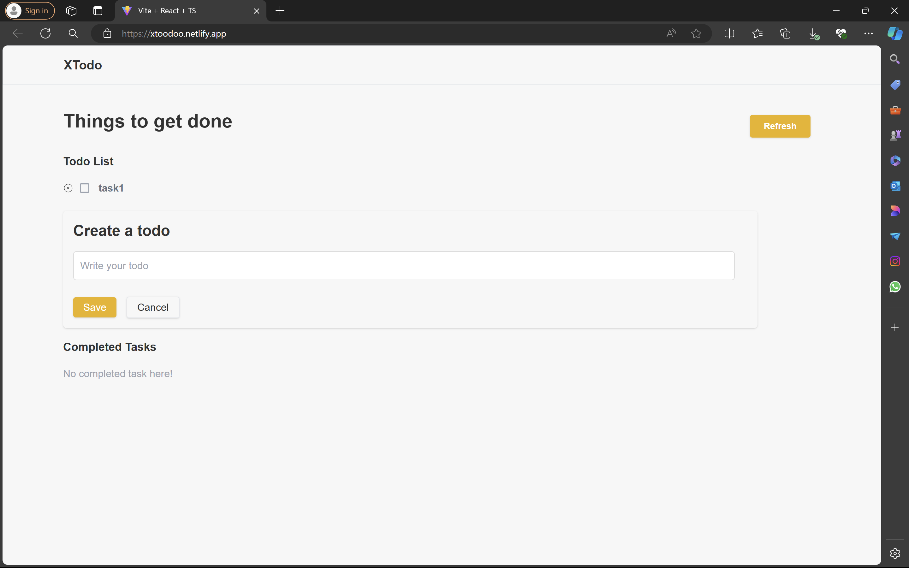

Based on the details you've provided, here's a draft for your README file:

---

# Todo Webapp

## Description

The **Todo Webapp** is a simple yet effective tool to help you manage your tasks. With this app, you can easily add new tasks, remove completed ones, and keep track of your to-dos with ease. It's designed to be user-friendly and efficient, ensuring you can focus on getting things done.

## Features

- **Add Tasks:** Simply type your task into the input field and click the "Add" button to add it to your list.
- **Remove Tasks:** When you've completed a task, remove it by clicking the cross icon next to it.
- **Refresh List:** Use the "Refresh" button to clear the current state and reload the task list.

## Technologies Used

- **React:** A JavaScript library for building user interfaces.
- **Tailwind CSS:** A utility-first CSS framework for styling.
- **TypeScript:** A typed superset of JavaScript that adds static types.

## Installation and Setup

1. Clone the repository:
    ```bash
    git clone https://github.com/PaarthAgarwal1/todo.git
    ```
2. Navigate to the project directory:
    ```bash
    cd todo
    ```
3. Install the dependencies:
    ```bash
    npm install
    ```
4. Start the development server:
    ```bash
    npm start
    ```

## Usage

- **Adding Tasks:** Enter your task in the input field and click the "Add" button. Your task will appear in the list below.
- **Removing Tasks:** Click the cross icon next to the task you want to remove.
- **Refreshing the List:** Click the "Refresh" button to reload the task list.

## Deployment

The app is deployed on Netlify and can be accessed at [xtoodoo.netlify.app](https://xtoodoo.netlify.app/).

## Screenshots




## Contributing

Currently, contributions are not being accepted.

## License

This project is not licensed under any specific license.

## Acknowledgments

_(No acknowledgments required at this time.)_

---

